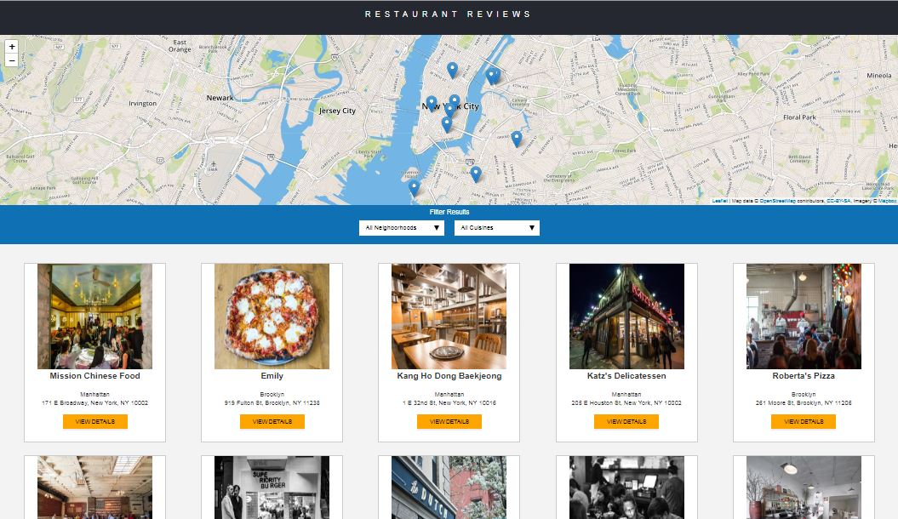

# Restaurant Review App

## Table of Contents
* [About the Project](#about-the-project)
* [Steps to run the Project](#steps-to-run-the-project)
* [Credits](#credits)
* [License](#license)

### About the Project
* Udacity gives the code for a restaurant review website that lacks `Accessibility` and `Offline Experience`.
* `Responsive Design` also was messed up for different viewport sizes.
* All i have to do was making the site `Responsive` for different viewport sizes, implement `Accessibility` concept and make the website work offline through `Service Worker`.

### Steps to run the Project
You can visit the live demo [here](https://malakjoseph.github.io/restaurant-review-app/).

### Credits
* Code from [Udacity](https://github.com/udacity/mws-restaurant-stage-1)
* [leafletjs](https://leafletjs.com/) with [Mapbox](https://www.mapbox.com/)

### License
This project is licensed under the terms of the MIT license.
